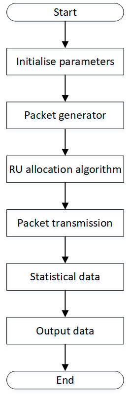

# Resource allocation for OFDMA under IEEE 802.11ax

This project simulates the network traffic under IEEE 802.11ax and test the performance on channel utilisation, fairness and packet reordering problem of different resource unit (RU) allocation algorithms including First in First out (FIFO), Dynamic Programming combined with Timsort (DPT), Updated Dynamic Programming combined with Timsort (UDPT), Greedy algorithm (GrA), Genetic algorithm (GnA) and Simulated Annealing (SA).

# Purpose of this project

The purpose of this project is to compare the performance of different optimisation techniques on RU allocation for downlink traffic uder IEEE 802.11ax OFDMA mechanism.

# Project structure
Resource allocation for OFDMA under IEEE 802.11ax/
├── ns # This folder is downloaded from https://github.com/TL-System/ns.py
├── bursty_traffic_generation.py  # packet generator for the simulator, half packets follow pareto distribution, half packets follow Gaussian distribution
├── RunSimulator/  
│   ├── DynamicProgrammingCombinedwithTimsort.py  # The simulator for DPT algorithm. The retransmission rate can be set by the parameter retransmission_rate.  
│   ├── FIFO.py  # The simulator for FIFO algorithm. The retransmission rate can be set by the parameter retransmission_rate.  
│   ├── Genetic Algorithm.py # The simulator for GnA algorithm. The retransmission rate can be set by the parameter retransmission_rate.  
│   ├── GreedyAlgorithm.py  # The simulator for GrA algorithm. The retransmission rate can be set by the parameter retransmission_rate.  
│   ├── RunFIFO.py  # Run the simulator for FIFO algorithm with different number of users and it will output the average channel utilisation of different numbers of users, average Jain's Fairness index of different numbers of users, average R-value of different number of users and average program runnning time of different number of users.  
│   ├── RunGeneticAlgorithm.py  # Run the simulator for GnA algorithm with different number of users and it will output the average channel utilisation of different numbers of users, average Jain's Fairness index of different numbers of users, average R-value of different number of users and average program runnning time of different number of users.  
│   ├── RunGreedyAlgorithm.py  # Run the simulator for GrA algorithm with different number of users and it will output the average channel utilisation of different numbers of users, average Jain's Fairness index of different numbers of users, average R-value of different number of users and average program runnning time of different number of users.  
│   ├── RunSimulatedAnnealing.py  # Run the simulator for SA algorithm with different number of users and it will output the average channel utilisation of different numbers of users, average Jain's Fairness index of different numbers of users, average R-value of different number of users and average program runnning time of different number of users.  
│   ├── RunSimulatorwithDPT.py  # Run the simulator for DPT algorithm with different number of users and it will output the average channel utilisation of different numbers of users, average Jain's Fairness index of different numbers of users, average R-value of different number of users and average program runnning time of different number of users.  
│   ├── RunSimulatorwithUDPT.py  # Run the simulator for UDPT algorithm with different number of users and it will output the average channel utilisation of different numbers of users, average Jain's Fairness index of different numbers of users, average R-value of different number of users and average program runnning time of different number of users.  
│   ├── SimulatedAnnealing.py  # The simulator for SA algorithm. The retransmission rate can be set by the parameter retransmission_rate.  
│   ├── UpdatedDynamicProgrammingCombinedwithTimsort.py  # The simulator for UDPT algorithm. The retransmission rate can be set by the parameter retransmission_rate.  
├── .gitignore  
└── Readme.md  

# Introduction to the project

The figure above illustrates the flow chart of the simulator in this project.

The first step of the simulator is to initialise the parameters. In this step, the simulator initialises channel conditions (represented by retransmission rate), MCS value and number of spatial streams. These parameters influence the theoretical maximum throughput of a RU and the demand for subcarriers of a packet.

After initialising the parameters, the simulator generates packets. Throughout the packet generation process, the simulator first constructs a Batch Markov Arrival Process(BMAP) generator based on the input transition matrix which continuously generates packet interarrival times that conform to statistical properties. Meanwhile, the packet size is generated randomly according to the Pareto Distribution or the Gaussian Distribution. The packet generator runs in a discrete event environment on SimPy. Each packet contains a timestamp (i.e. the time that the packet arrives in the buffer), packet size and flow ID (i.e. the expected order of the packet arrival at the receiver). In summary, the packet generation process combines the arrival process modelling provided by BMAP, the packet size distribution provided by random functions, and the event scheduling mechanism of SimPy.

After packet generation, the RU allocation algorithm will allocate the RUs according to the data obtained from the last two steps. This simulator implements Dynamic Programming combined with Timsort, Updated Dynamic Programming combined with Timsort, Simulated Annealing, Greedy Algorithm and Genetic Algorithm for RU allocations of downlink traffic under the IEEE 802.11ax OFDMA mechanism.

After RU allocation, the packets will be transmitted according to the RU allocation schemes generated by the RU allocation algorithms. The transmissions of different RUs are simultaneously and the retransmission strategy is according to CSMA/CA.

After the simulation of packet transmissions, the simulator counts the data which is the metrics in this thesis. The data includes channel utilisation, Jain’s Fairness Index, R-value and calculation time.

Finally, the simulator output the data above in text form.

In summary, this simulator complies with the IEEE 802.11ax standard and implements various resource allocation and scheduling algorithms, while measuring multi-dimensional performance metrics such as channel utilisation, R value, fairness, and computation time. Although the physical layer modelling simplifies complexity (by using fixed MCS values and a fixed number of spatial streams in experiments), its core purpose is to compare the RU allocation algorithms on the MAC layer and their impact on network performance. Therefore, this simulator can be considered reliable for evaluating different RU allocation algorithms.

# Running the project

The `RunSimulator/` directory contains several simulation scripts, each corresponding to a different RU allocation algorithms. You can run any of them independently using Python. You can set the channel conditions by setting the retransmission_rate which represents the retransmission rate of the packet transmissions in each python file named by different RU allocation algorithms name.

# Library requirements
This project uses Python 3.9.

This project uses the following Python libraries:
numpy
math

# License

This project is licensed under the Apache License 2.0.  
See the [LICENSE](LICENSE) file for details.

# Contact

Maintained by YangYu1006.
